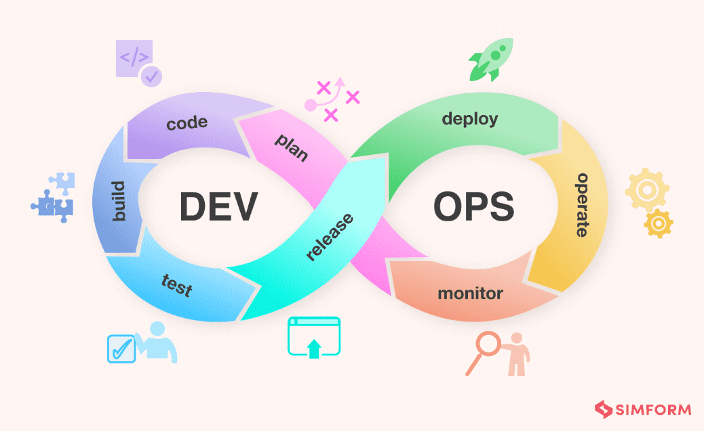

# DevSecOps-TaskManager: DevOps Lifecycle Implementation with Security Integration

## Overview
**DevSecOps-TaskManager** is a comprehensive learning project that demonstrates the complete **DevOps lifecycle** through a **Node.js (Express) Task Manager API**. This project showcases how to implement DevOps practices while integrating security (DevSecOps) across all stages of the software development lifecycle.

## 🚀 DevOps Lifecycle Implementation



This project implements the complete DevOps lifecycle:

### **Plan** 📋
- **Requirements gathering** and **project planning**
- **Architecture design** with security considerations
- **Technology stack selection** (Node.js, Express, PostgreSQL, Docker)

### **Code** 💻
- **Version control** with GitHub
- **Code quality standards** with ESLint
- **Security-first coding practices**
- **Documentation** and **code comments**

### **Build** 🔨
- **Automated builds** with GitHub Actions
- **Docker containerization** for consistent environments
- **Dependency management** with pnpm
- **TypeScript compilation** and **optimization**

> 📸 **Screenshot Placeholder**: GitHub Actions workflow success
> 📸 **Screenshot Placeholder**: Docker build process and image creation

### **Test** 🧪
- **Unit testing** with Jest (22/22 tests passing)
- **Integration testing** with real database connections
- **Code coverage** reporting
- **Security testing** with Trivy vulnerability scanning

> 📸 **Screenshot Placeholder**: Jest test results showing 22/22 tests passing
> 📸 **Screenshot Placeholder**: Supertest integration test results
> 📸 **Screenshot Placeholder**: Code coverage report dashboard

### **Release** 📦
- **Automated versioning** and **tagging**
- **Artifact generation** and **storage**
- **Quality gates** with SonarQube
- **Security scanning** before release

> 📸 **Screenshot Placeholder**: SonarQube quality gate results
> 📸 **Screenshot Placeholder**: Trivy security scan results
> 📸 **Screenshot Placeholder**: GitHub release artifacts

### **Deploy** 🚀
- **Container orchestration** with Docker Compose
- **Azure deployment** strategies
- **Environment configuration** management
- **Rollback capabilities**

> 📸 **Screenshot Placeholder**: Docker Compose services running
> 📸 **Screenshot Placeholder**: Azure deployment dashboard
> 📸 **Screenshot Placeholder**: Jenkins deployment pipeline

### **Operate** ⚙️
- **Application monitoring** with Prometheus
- **Log aggregation** and **analysis**
- **Performance monitoring**
- **Health checks** and **alerts**

> 📸 **Screenshot Placeholder**: Prometheus metrics dashboard
> 📸 **Screenshot Placeholder**: Application health check status
> 📸 **Screenshot Placeholder**: Log aggregation view

### **Monitor** 📊
- **Real-time dashboards** with Grafana
- **Metrics collection** and **visualization**
- **Alert management**
- **Continuous feedback loops**

> 📸 **Screenshot Placeholder**: Grafana monitoring dashboard
> 📸 **Screenshot Placeholder**: Application performance metrics
> 📸 **Screenshot Placeholder**: Alert management interface

---

## 🔒 DevSecOps Integration

While implementing the DevOps lifecycle, this project also demonstrates **DevSecOps** principles:

- **Security in Planning**: Threat modeling and security requirements
- **Secure Coding**: Input validation, authentication, and authorization
- **Secure Building**: Container security scanning with Trivy
- **Security Testing**: SAST with SonarQube, vulnerability scanning
- **Secure Deployment**: Secrets management, secure configurations
- **Security Monitoring**: Security metrics and incident response

---

## 🛠️ Technology Stack

### **Core Application**
- **Backend**: Node.js with Express.js
- **Database**: PostgreSQL with Drizzle ORM
- **Authentication**: JWT with bcrypt
- **Validation**: Zod schemas
- **Testing**: Jest with Supertest

### **DevOps Tools**
- **CI/CD**: GitHub Actions + Jenkins
- **Containerization**: Docker + Docker Compose
- **Code Quality**: ESLint + SonarQube
- **Security**: Trivy vulnerability scanner
- **Monitoring**: Prometheus + Grafana
- **Cloud**: Azure deployment

### **Development Tools**
- **Package Manager**: pnpm
- **TypeScript**: Type safety and modern JavaScript
- **Database Migrations**: Drizzle Kit
- **API Documentation**: Built-in with Express

---

## 📌 Observations & Learnings

When starting this project, I approached it mainly from a **DevSecOps mindset**, focusing heavily on security.  
However, as I progressed, I realized that:

- **DevOps is a full lifecycle** (plan → code → build → test → release → deploy → operate → monitor), not just CI/CD pipelines.  
- **DevSecOps extends DevOps** by embedding security across all stages, but DevOps itself also emphasizes collaboration, automation, and monitoring.  
- Automation is important, but so is **team culture** and **continuous feedback loops**.  
- Observability (logs, monitoring, alerts) is just as essential as testing and security.  
- CI/CD pipelines are the backbone — in this project, I implemented CI (linting, migrations, tests, coverage reports) and can extend into CD (deployment).  

This project is therefore both a **DevOps learning journey** and a **DevSecOps practice project**, combining security awareness with the broader DevOps lifecycle.

### **Key DevOps Principles Demonstrated:**
- **Collaboration**: Cross-functional team practices
- **Automation**: Automated testing, building, and deployment
- **Continuous Integration**: Automated code quality checks
- **Continuous Delivery**: Ready-to-deploy artifacts
- **Monitoring**: Application and infrastructure observability
- **Feedback Loops**: Continuous improvement based on metrics

### **DevSecOps Security Integration:**
- **Shift Left Security**: Security considerations from the planning phase
- **Security as Code**: Infrastructure and configuration as code
- **Automated Security Testing**: SAST, vulnerability scanning
- **Security Monitoring**: Real-time security metrics and alerts

---

## ⚙ DevOps Lifecycle Setup Guide

### **Phase 1: Plan & Code** 📋💻
```bash
# Clone the repository
git clone https://github.com/your-username/DevSecOps-TaskManager.git
cd DevSecOps-TaskManager

# Review the architecture and requirements
# - Node.js Express API
# - PostgreSQL database
# - Docker containerization
# - Security considerations
```

### **Phase 2: Build & Test** 🔨🧪
```bash
# Install dependencies
pnpm install

# Run the development environment
docker-compose up -d

# Execute tests
pnpm run test:unit        # Unit tests (22/22 passing)
pnpm run test:integration # Integration tests
pnpm run lint            # Code quality checks
```

### **Phase 3: Release & Deploy** 📦🚀
```bash
# Build Docker images
docker build -t taskmanager-api .

# Run security scans
trivy image taskmanager-api

# Deploy to Azure
# Configure Azure Container Instances or VM deployment
```

### **Phase 4: Operate & Monitor** ⚙️📊
```bash
# Start monitoring stack
docker-compose -f docker-compose.prod.yml up -d

# Access monitoring dashboards
# - Grafana: http://localhost:3000
# - Prometheus: http://localhost:9090
# - Application: http://localhost:5000
```

---

## 🛠️ DevOps Tools Configuration

### **CI/CD Pipeline Setup**
```bash
# GitHub Actions (already configured)
# - Automated testing on push/PR
# - Code quality checks
# - Security scanning

# Jenkins Integration
# - Webhook URL: http://<jenkins-server>/github-webhook/
# - Configure credentials for GitHub, SonarQube, and Azure
```

> 📸 **Screenshot Placeholder**: GitHub Actions workflow runs
> 📸 **Screenshot Placeholder**: Jenkins pipeline execution
> 📸 **Screenshot Placeholder**: CI/CD pipeline overview

### **Monitoring & Observability**
- **Prometheus**: Metrics collection and storage
- **Grafana**: Visualization and alerting
- **Application Metrics**: Custom business metrics
- **Infrastructure Monitoring**: System and container metrics

> 📸 **Screenshot Placeholder**: Complete monitoring stack overview
> 📸 **Screenshot Placeholder**: Grafana dashboard with custom metrics
> 📸 **Screenshot Placeholder**: Prometheus targets and metrics

---

## 📸 Screenshots & Evidence

*This section will be updated as the project progresses to show authentic evidence of working DevOps tools and processes.*

### **Testing & Quality Assurance**
- [ ] Jest unit test results (22/22 passing)
- [ ] Supertest integration test results
- [ ] Code coverage report
- [ ] ESLint code quality check results

### **CI/CD Pipeline**
- [ ] GitHub Actions workflow success
- [ ] Jenkins pipeline execution
- [ ] Docker build process
- [ ] SonarQube quality gate results

### **Security & Scanning**
- [ ] Trivy vulnerability scan results
- [ ] Security scan dashboard
- [ ] Dependency audit results

### **Deployment & Infrastructure**
- [ ] Docker Compose services running
- [ ] Azure deployment dashboard
- [ ] Container orchestration status

### **Monitoring & Observability**
- [ ] Grafana monitoring dashboard
- [ ] Prometheus metrics dashboard
- [ ] Application health check status
- [ ] Alert management interface

### **Development Tools**
- [ ] VS Code with project setup
- [ ] Database schema visualization
- [ ] API documentation interface
