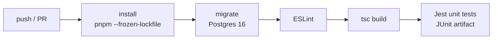

# DevSecOps Lab: Task Manager API with Quality Gates

A Node.js / TypeScript task-manager API (Express, PostgreSQL, Drizzle ORM, JWT)
used to practise **enforcing quality in the delivery pipeline**: linting, type
checks and automated tests run in CI before anything is built, and the running
service is observable through Prometheus and Grafana.

This is a learning lab, not a production system. The table below separates what
runs today from what is configured but not yet enforced.

## Status at a glance

| Capability | Status | Evidence |
| --- | --- | --- |
| GitHub Actions CI | **Enforced** | [`.github/workflows/ci.yml`](.github/workflows/ci.yml): Postgres 16 service, migrations, ESLint, `tsc` build, Jest unit tests with JUnit report artifact. A failing step fails the build |
| Unit tests | **Enforced in CI** | 22 Jest tests ([`__tests__/unit`](__tests__/unit)): auth and task controllers |
| Integration tests | Run locally only | 28 Jest + Supertest tests against a real database ([`__tests__/integration`](__tests__/integration)); not yet enabled in CI |
| Health check | Run locally | 3 tests ([`__tests__/health.test.ts`](__tests__/health.test.ts)) |
| Metrics | **Implemented** | `/metrics` via `prom-client`: default process metrics, HTTP request counter, error counter, request-duration histogram ([`src/middleware/prometheus.ts`](src/middleware/prometheus.ts)) |
| Dashboards | **Implemented** | Prometheus scrape config ([`prometheus.yml`](prometheus.yml)) and a provisioned Grafana dashboard ([`grafana/`](grafana)) in Docker Compose |
| Jenkins pipeline | Defined, not yet proven | [`Jenkinsfile`](Jenkinsfile) and a Jenkins container configured as code ([`jenkins/`](jenkins)); see limitations |
| Dependency audit | Defined in Jenkins | `pnpm audit --audit-level moderate` stage |
| Trivy scanning | **Report-only** | Filesystem and image scans run with `--exit-code 0`, so findings do not fail the pipeline yet |
| SonarQube | **Planned** | Stage and service are commented out; `sonar-project.properties` is empty |
| Azure deployment | **Planned** | `main.tf` is empty; no deployment has been made from this repository |

## Pipeline


```mermaid
flowchart LR
  A[push / PR] --> B[install<br/>pnpm --frozen-lockfile]
  B --> C[migrate<br/>Postgres 16]
  C --> D[ESLint]
  D --> E[tsc build]
  E --> F[Jest unit tests<br/>JUnit artifact]
```

The GitHub Actions job fails on any lint error, type error, failed migration or
failing unit test, which is the quality gate actually enforced today.

The Jenkinsfile describes the intended fuller pipeline:
checkout → install → lint ∥ type-check → tests with coverage → dependency audit →
build → Docker build → Trivy image scan → staging deploy and integration tests
(`develop`) → manual approval and production deploy (`main`).

## Quality gates: current vs target

| Gate | Fails the build today? | Target |
| --- | --- | --- |
| Lint (ESLint) | Yes | — |
| Type check (`tsc`) | Yes | — |
| Unit tests | Yes | — |
| Integration tests | No (not in CI) | Run in CI against the Postgres service |
| Coverage threshold | No (collected, no threshold) | Enforce a minimum in `jest.config.ts` |
| Dependency audit | Jenkins only | Also in GitHub Actions |
| Trivy (filesystem / image) | No (`--exit-code 0`) | Fail on HIGH/CRITICAL |
| SonarQube quality gate | No (not configured) | Configure project and gate |

## Running locally

```bash
pnpm install
cp .env.example .env              # then set DATABASE_URL, JWT secrets, JENKINS_ADMIN_PASSWORD
docker compose up -d              # API, Postgres, Redis, Prometheus, Grafana, Jenkins
pnpm migrate
pnpm run test:unit                # 22 unit tests
pnpm run test:integration         # 28 integration tests (needs the database)
pnpm lint && pnpm build
```

The Jenkins container reads its admin password from `JENKINS_ADMIN_PASSWORD`;
set it in your shell or `.env` before `docker compose up`.

- API and metrics: http://localhost:3000, http://localhost:3000/metrics
- Grafana: http://localhost:3001
- Prometheus: http://localhost:9090
- Jenkins: http://localhost:8080

More detail: [`docs/`](docs) (ESLint, Docker, Jenkins, Grafana, Trivy & SonarQube notes).

## Known limitations

- Integration tests are not part of CI, and there is no coverage threshold.
- Trivy runs report-only; SonarQube and Azure deployment are not configured.
- The Jenkinsfile has not been run end to end from this repository. It still
  references a placeholder registry, and the coverage and ESLint report
  publishing steps need adjusting before it can pass.
- Docker Compose files contain local development credentials for the database
  and JWT secret. They are for local use only and must be replaced by real
  secrets in any shared environment.

## What I learned

- DevOps is a full lifecycle (plan → code → build → test → release → deploy →
  operate → monitor), not only CI/CD.
- A security tool only becomes a gate when its failure stops the pipeline.
  Report-only scanners are useful for visibility, not enforcement.
- Observability (metrics, dashboards, health checks) is as essential to release
  confidence as tests.

---

Maintained by [Gideon Ngetich](https://github.com/Ngetich-86) ·
[Portfolio](https://gideon-ngetich.vercel.app/)
